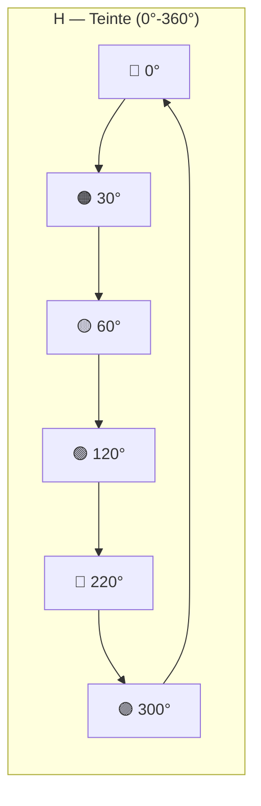
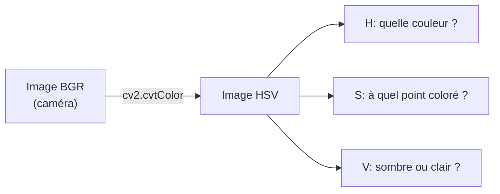
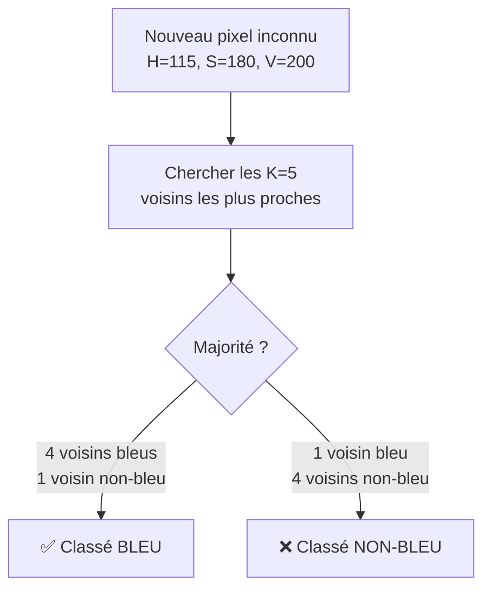
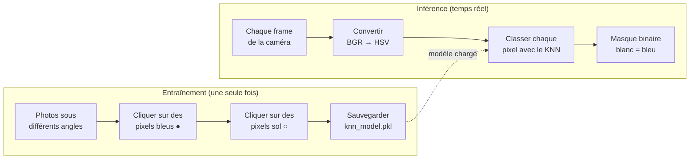
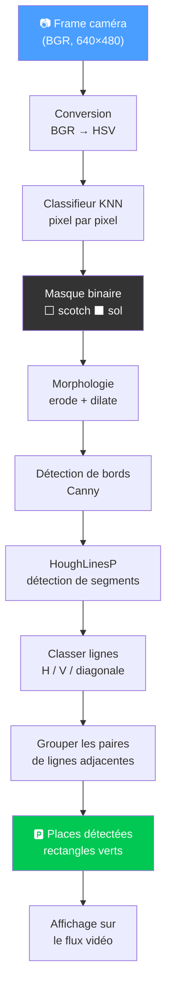
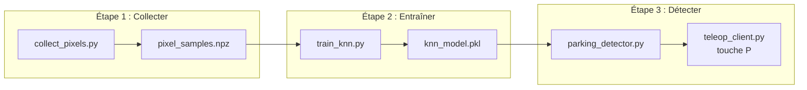

# 🅿️ Détection de Places de Parking — Documentation Technique

> Pipeline complet : Classifieur KNN de pixels HSV + reconstruction géométrique HoughLinesP.

---

## Table des matières

- [L'espace colorimétrique HSV](#lespace-colorimétrique-hsv)
- [Le classifieur KNN](#le-classifieur-knn)
- [Pipeline complet de détection](#pipeline-complet-de-détection)
- [Scripts et fichiers](#scripts-et-fichiers)

---

## L'espace colorimétrique HSV

### Pourquoi HSV et pas RGB ?

En **RGB**, un même scotch bleu change radicalement de valeurs selon l'éclairage :

```
Lumière forte :  R=100, G=150, B=250
Lumière faible : R=30,  G=50,  B=120
Ombre :          R=15,  G=25,  B=60
```

En **HSV** (aussi appelé **TLS** : Teinte, Luminosité, Saturation), la **teinte** (H) reste stable :

```
Lumière forte :  H=220°, S=80%, V=98%
Lumière faible : H=220°, S=75%, V=47%
Ombre :          H=218°, S=70%, V=24%
                 ^^^^^^
                 La teinte ne bouge presque pas !
```

### Les 3 composantes



```mermaid
graph LR
    subgraph "S — Saturation (0-255)"
        S0["0 = Gris pur ◻️"] ---|+|--> S128["128 = Couleur pâle"] ---|+|--> S255["255 = Couleur vive 🔵"]
    end
```

```mermaid
graph LR
    subgraph "V — Luminosité (0-255)"
        V0["0 = Noir ⬛"] ---|+|--> V128["128 = Médium"] ---|+|--> V255["255 = Clair ☀️"]
    end
```

### Conversion BGR → HSV



> ⚠️ **Attention** : OpenCV utilise H sur [0-179] (pas 0-360). Donc le bleu est autour de **H = 100-130** en OpenCV, pas 200-240.

---

## Le classifieur KNN

### Problème avec les seuils HSV manuels

Avec des seuils fixes (`H_min=90, H_max=130, S_min=50, etc.`), on définit un **rectangle** dans l'espace HSV :

```
Saturation
    255 ┤ ┌──────────────────┐
        │ │  Zone "bleue"    │ ← rectangle fixe
        │ │  (seuils min/max)│    tout ce qui est dedans = bleu
     50 ┤ └──────────────────┘
      0 ┤
        └──────┬──────┬──────── Teinte (H)
              90    130
```

**Problème** : la vraie distribution des pixels bleus n'est pas un rectangle ! Des pixels du sol gris peuvent tomber dedans, des pixels bleus foncés peuvent en sortir.

### Solution : KNN (K-Nearest Neighbors)

Le KNN **apprend** la frontière réelle entre les pixels "scotch bleu" et les pixels "pas scotch" :

```
Saturation
    255 ┤      ●● ●●●●
        │     ●●●●●●●●●●  ← pixels scotch bleu (collectés)
        │    ●●●●●●●●●●●
        │     ●●●●●●●●●
        │  ○    ●●●●●●     ● = échantillon "bleu"
     50 ┤ ○○○    ●●●       ○ = échantillon "pas bleu"
        │ ○○○○○○
        │  ○○○○○○○         Le KNN trace une frontière
      0 ┤   ○○○○            courbe qui suit la vraie forme
        └──────┬──────┬──── Teinte (H)
              90    130
```

### Comment fonctionne le KNN





### Avantages du KNN vs seuils manuels

| | Seuils HSV manuels | KNN |
|---|---|---|
| **Forme** | Rectangle fixe | Frontière courbe adaptée |
| **Robustesse** | ❌ Sensible à la lumière | ✅ Apprend les variations |
| **Calibration** | Curseurs à régler à l'œil | Clics sur des exemples |
| **Réentraînable** | Tout refaire à la main | Recliquer + réentraîner |

---

## Pipeline complet de détection



### Détail de chaque étape

| # | Étape | Fonction OpenCV | Explication |
|---|-------|----------------|-------------|
| 1 | BGR → HSV | `cv2.cvtColor()` | Sépare couleur, saturation, luminosité |
| 2 | Classification | `knn.predict()` | Chaque pixel → bleu ou pas bleu |
| 3 | Masque | — | Image noir/blanc (blanc = scotch) |
| 4 | Morphologie | `cv2.morphologyEx()` | Bouche les trous, supprime le bruit |
| 5 | Bords | `cv2.Canny()` | Détecte les contours nets |
| 6 | Lignes | `cv2.HoughLinesP()` | Trouve les segments droits |
| 7 | Groupement | Code custom | Paires de verticales = places |

---

## Scripts et fichiers



| Fichier | Rôle | Tourne sur |
|---------|------|-----------|
| `collect_pixels.py` | Collecter pixels bleus/non-bleus par clics | PC |
| `train_knn.py` | Entraîner le KNN et sauvegarder le modèle | PC |
| `parking_detector.py` | Pipeline complet de détection | PC |
| `teleop_client.py` | Affichage + touche P on/off | PC |

---

## Pour aller plus loin (kart réel)

Le passage au kart nécessite uniquement de **réentraîner** le KNN :

| | Voiture miniature | Kart réel |
|---|---|---|
| **Marquage** | Scotch bleu sur parquet | Lignes blanches sur asphalte |
| **Pipeline** | Identique | Identique |
| **À refaire** | — | `collect_pixels.py` + `train_knn.py` |
| **Code à modifier** | — | Rien |

---

## Méthodologie pas à pas

### Étape 1 — Collecter des pixels (sur la Pi, depuis ton PC)

```bash
cd python_camera
python collect_pixels.py --pi-ip <IP_DE_LA_PI>
```

1. Le script capture un frame depuis la caméra
2. Une fenêtre s'ouvre avec l'image
3. **Clic gauche** sur le scotch bleu → marqueur vert ✅
4. **Clic droit** sur le sol/murs → marqueur rouge ❌
5. **N** pour prendre une nouvelle photo (change l'angle/lumière)
6. **Entrée** pour sauvegarder → `pixel_samples.npz`

> [!TIP]
> Clique sur **20-30 endroits différents** du scotch (bords, centre, zones sombres, zones éclairées) et autant sur le sol. Plus tu varies les conditions, meilleur sera le classifieur.

### Étape 2 — Entraîner le KNN

```bash
python train_knn.py
```

Le script affiche automatiquement :
- Matrice de confusion (TP, FP, FN, TN)
- Accuracy, Précision, Rappel, F1-score
- Comparaison avec différentes valeurs de K
- Images dans le dossier `knn_results/`

> [!IMPORTANT]
> Vise **Accuracy > 95%** et **F1 > 0.90**. Si c'est en dessous, relance `collect_pixels.py` pour ajouter plus d'échantillons.

### Étape 3 — Tester la détection en live

```bash
python teleop_client.py --pi-ip <IP_DE_LA_PI>
```

Appuie sur **P** pour activer la détection. Tu verras :
- Le badge `[KNN]` en haut à droite (confirme que le modèle est utilisé)
- Les rectangles verts sur les places détectées
- Le mini masque en bas à droite (blanc = scotch détecté)

