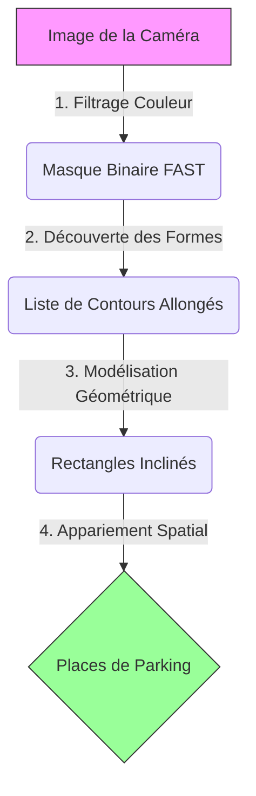
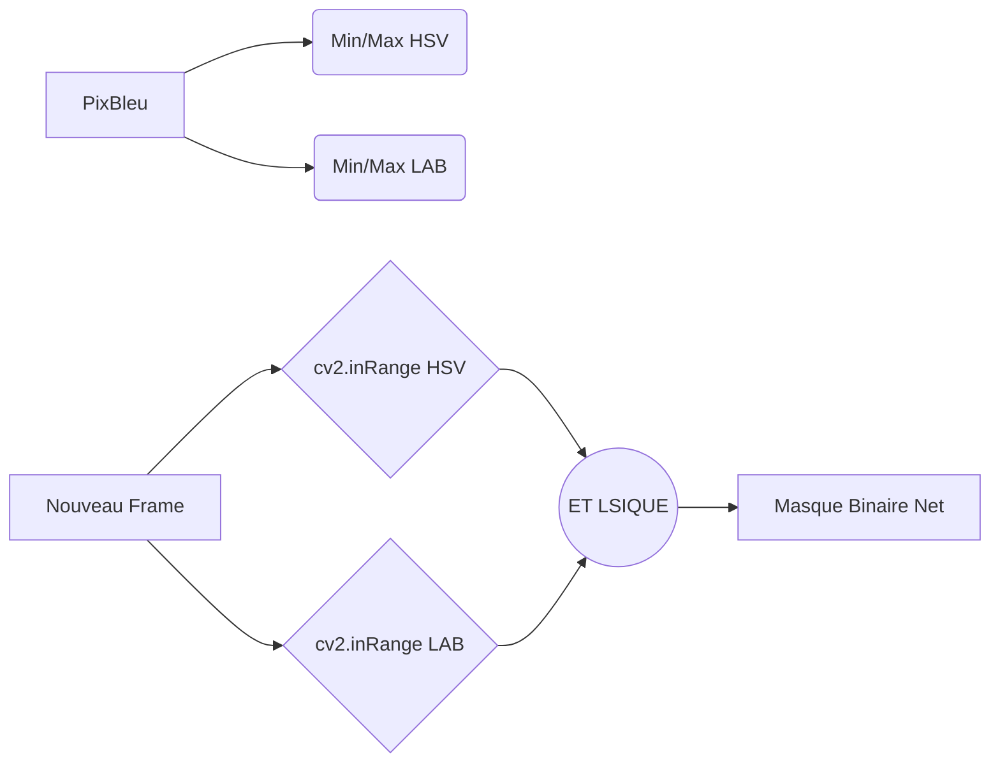
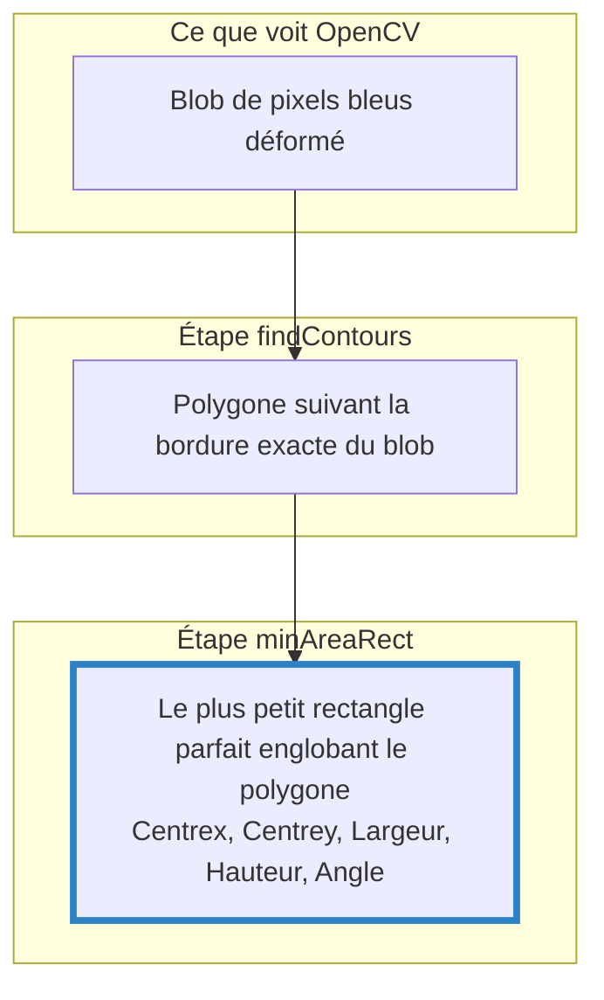
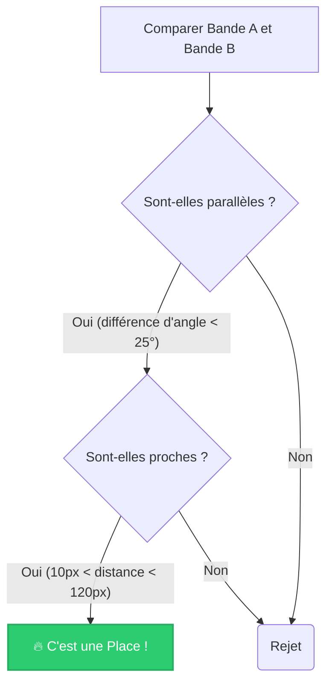

# Architecture de Détection de Parking (V2)

Ce document explique en détail la nouvelle logique de détection basée sur les **contours géométriques (Option B)**, qui vient remplacer l'ancienne approche (HoughLinesP) devenue obsolète face à la perspective de la caméra.

---

## 🏗️ Le Pipeline de Détection

La détection d'une place s'effectue en 4 étapes consécutives, de l'image brute jusqu'à la liste finale des places validées.

---

## 🔍 Étape 1 : Le Filtrage Couleur (Mode FAST)

Avant de chercher des formes, il faut isoler ce qui nous intéresse : le scotch bleu. Le KNN était trop lent car il testait *chaque pixel individuellement*. Le mode **FAST** utilise des seuils pré-calculés.

### Le Principe
Lors de l'entraînement (`train_knn.py`), le script analyse tes pixels annotés et calcule les valeurs limites (min/max) pour les couleurs de type bleu, dans deux espaces de couleurs différents : **HSV** (Teinte, Saturation, Valeur) et **LAB** (Luminance, Rouge/Vert, Bleu/Jaune).

**Pourquoi combiner HSV et LAB ?**
La caméra Raspberry Pi est très sensible aux variations d'éclairage (le même scotch paraît gris foncé à l'ombre et bleu clair au soleil). Combiner les deux filtres réduit drastiquement les faux positifs (comme un reflet sur le sol gris) sans perdre la vraie couleur bleue.

---

## 📏 Étape 2 & 3 : `findContours` & `minAreaRect`

C'est ici que se trouve le changement majeur. Anciennement, `HoughLinesP` cherchait des lignes composées de points mathématiquement parfaits. Mais **avec la perspective de la caméra grand angle, les lignes sont courbes et épaisses.**

### L'approche par Contours
Plutôt que de chercher une "ligne", on cherche un "amas de pixels" (un blob) et on trace son contour via `cv2.findContours`.

Ensuite, on modélise ce blob non pas comme une ligne infinie, mais comme une **étiquette rigide (un rectangle)** orientée dans l'espace avec `cv2.minAreaRect`.

### Le Filtrage des Bandes de Scotch
Évidemment, tous les blobs bleus ne sont pas du scotch. On filtre ces rectangles candidats :
1. **L'Aire :** Si le blob est trop petit (`area < 80`), c'est du bruit.
2. **L'Aspect Ratio :** Un bout de scotch est long et fin. On demande donc que le rectangle trouvé soit au moins 2.5 fois plus long que large (`aspect >= 2.5`). Si c'est un carré bleu, on le rejette.

---

## 🤝 Étape 4 : Appariement Spatial (Trouver les places)

Une fois que l'algorithme a trouvé toutes les bandes bleues (les séparateurs), il faut comprendre lesquelles forment une place de parking.
Une place est définie par **deux bandes parallèles proches**.

### La Logique de Groupement
L'algorithme (`_group_into_spots`) trie toutes les bandes par leur position X (de gauche à droite sur l'image).
Ensuite, pour chaque bande (Bande A), il regarde les autres bandes à sa droite (Bande B) et applique deux critères stricts :

### Avantages de cette Logique
- **Indépendant de l'angle :** Même si ta voiture aborde la place à 45° de travers, les deux bandes de côté resteront parallèles *entre elles* sur l'image locale, donc la place sera détectée.
- **Résistant aux omissions :** S'il manque 10cm de scotch au milieu d'une bande à cause de l'usure, `findContours` trouvera un rectangle plus court, mais qui restera parallèle à la bande d'en face.

---

## 🪲 Pistes d'évolution et Debug

Bien que ce système soit robuste à la perspective, il a quelques points de défaillance prévisibles qu'on peut surveiller et améliorer si le projet évolue :

### 1. La Distorsion "Barrel" (Effet Go-Pro)
La lentille grand-angle de ta Pi déforme les lignes droites en **courbes** sur les bords de l'image.
- **Le problème :** Un scotch courbé dans un coin de l'image va générer un rectangle "obèse" (car `minAreaRect` trace un rectangle rigide autour de la courbe). L'aspect ratio pourrait tomber sous les 2.5 et la bande serait rejetée.
- **La solution (si nécessaire) :** Effectuer une "calibration de l'objectif" (Undistortion) avec OpenCV avant de traiter le frame. L'image sera aplatie et les lignes redeviendront droites.

### 2. Le Filtrage Couleur FAST
Si l'éclairage de la salle change drastiquement, le bleu peut sortir des seuils calculés dans `knn_thresholds.json`.
- **La solution :** C'est pour ça qu'on a le nouvel outil de "clic & glisser" ! Il permet de recibler l'éclairage actuel en 10 secondes Chrono.

### 3. Les Places Tronquées
Si une seule ligne de la place est visible dans le champ de la caméra, l'algorithme ne comptera pas de place (puisqu'il en faut 2 pour valider).
- **La solution :** Si ton IA de navigation a besoin de savoir s'il y a un *début* de place, tu peux exposer directement la variable `rects` (les bandes détectées) dans `teleop_client.py` au lieu de te baser uniquement sur les `spots` terminés.
