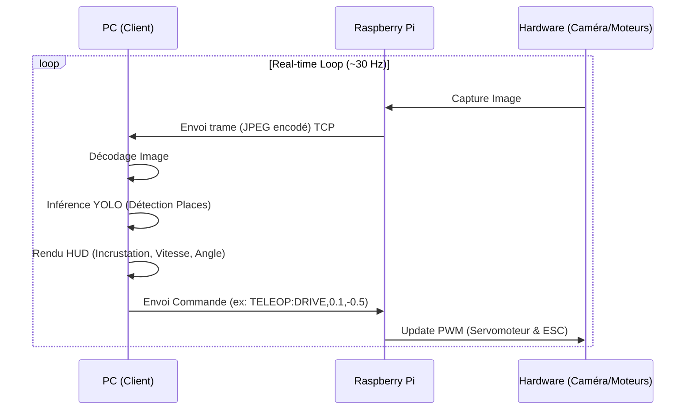

# Dossier Technique : Projet Voiture Autonome et Détection de Parking

Ce document compile l'intégralité du travail réalisé sur le projet de voiture autonome et de détection de places de parking. Il est conçu pour servir de base exhaustive à la rédaction d'un rapport de projet officiel, en détaillant les choix techniques, les architectures, et l'évolution des algorithmes.

---

## 1. Introduction et Objectifs
L'objectif du projet est de doter une voiture RC (télécommandée) de capacités d'assistance avancées (ADAS), notamment la détection intelligente de places de parking via un flux vidéo en temps réel. Le système opère de manière distribuée : la voiture (Raspberry Pi) s'occupe de l'acquisition vidéo et de l'actionnement mécanique, tandis qu'un poste de contrôle distant (PC Windows) se charge de l'intelligence artificielle, des calculs lourds, et de l'interface de pilotage (HUD).

---

## 2. Architecture Matérielle et Logicielle

### 2.1. Matériel
*   **Véhicule** : Châssis de voiture RC équipé d'un moteur DC (via ESC) et d'un servomoteur pour la direction.
*   **Unité embarquée** : Raspberry Pi (connecté en Wi-Fi).
*   **Capteur** : Caméra (frontale ou arrière) connectée au Raspberry Pi.
*   **Poste de contrôle** : PC Windows agissant comme client de téléopération, équipé d'un GPU/CPU pour l'inférence réseau de neurones.

### 2.2. Architecture d'Échange (Réseau)
Le système repose sur un modèle Client-Serveur via Wi-Fi :
*   **Serveur Vidéo (TCP)** : Le Raspberry Pi encode les images capturées (JPEG) et les envoie via un flux TCP (Port 8885).
*   **Client Vidéo & Traitement** : Le PC décode le flux, applique les algorithmes de détection (YOLO/KNN), et dessine l'interface homme-machine (HUD).
*   **Serveur de Commandes (TCP)** : Le Raspberry Pi écoute sur le port 8884 les consignes de vitesse et d'angle de braquage.
*   **Relais UDP (Optionnel)** : Le PC peut relayer le flux vidéo traité vers d'autres affichages (ex: CarPlay).

```mermaid
graph LR
    A[Caméra] -->|Raw Frames| B[Raspberry Pi]
    B -->|TCP 8885 (Video)| C[PC Windows Client]
    C -->|TCP 8884 (Cmds)| B
    C -->|Détection YOLO / KNN| D[Interface Qt / OpenCV]
    B -->|GPIO / PWM| E[ESC & Servomoteur]
```

### 2.3. Chronogramme Séquentiel (Boucle de Contrôle principale)



---

## 3. Évolution des Algorithmes de Détection

L'un des axes majeurs du projet a été le passage d'une méthode classique de traitement d'image (Heuristique) à une approche moderne par Deep Learning.

### 3.1. Approche Classique : Vision par Ordinateur et KNN
La première itération du système reposait sur des règles strictes définies manuellement.

**Principe de fonctionnement :**
1.  **Filtrage Colorimétrique (HSV)** : L'image est convertie de l'espace colorimétrique BGR vers HSV. Un masque isole spécifiquement le ruban adhésif bleu délimitant les places.
2.  **Opérations Morphologiques** : Application de filtres d'érosion et de dilatation (Fermeture) pour éliminer le bruit et boucher les trous dans les lignes détectées.
3.  **Extraction de Contours** : Utilisation de `cv2.findContours` combiné à une approximation polygonale (`approxPolyDP`) pour extraire les formes géométriques.
4.  **Filtrage Géométrique** : Conservation exclusive des quadrilatères respectant des critères stricts (surface, convexité, ratio des côtés).
5.  **Classification avec KNN (K-Nearest Neighbors)** : Pour éliminer les faux positifs restants, un algorithme de Machine Learning classique (KNN) est entraîné. Il prend en entrée 12 caractéristiques extraites de chaque quadrilatère (moments de Hu, compacité, rectangularité) et classe la forme comme "Place" ou "Non-Place".

**Limites de cette approche :**
*   **Sensibilité à la lumière** : Le masque HSV doit être recalibré dès que l'éclairage de la pièce change.
*   **Rigidité** : Si une place est partiellement coupée par le bord de l'image (polygone incomplet), elle n'est pas détectée.
*   **Bruit** : Les reflets sur le sol peuvent tromper le masque de couleur.

### 3.2. Approche Moderne : Deep Learning avec YOLOv8 (Instance Segmentation)
Pour pallier la fragilité de la méthode classique, nous avons implémenté un système de **Segmentation d'Instance** utilisant le modèle "YOLOv8-seg" d'Ultralytics.

**Principe de fonctionnement :**
1.  **Création du Dataset** : Déploiement d'un script (`record_dataset.py`) pour prendre des dizaines de photos du circuit sous divers angles et conditions lumineuses directement depuis le flux de la voiture.
2.  **Annotation** : Utilisation de l'outil *Roboflow* pour détourer manuellement les places de parking sur les images à l'aide de polygones précis.
3.  **Entraînement Local** : Conception du script `train_yolo.py` pour lancer l'entraînement du modèle `yolov8n-seg.pt` sur le PC en utilisant les données annotées (Transfer Learning sur 50 epochs).
4.  **Inférence en Temps Réel** : Lors de la conduite, l'image est passée directement au réseau de neurones (`parking_detector_yolo.py`) qui retourne non seulement les boîtes englobantes (Bounding Boxes), mais surtout les **masques exacts des pixels** appartenant à une place de parking, sans tenir compte de la luminosité ou de la couleur exacte.

**Avantages :**
*   **Robustesse extrême** : Insensible aux ombres, aux changements d'éclairage ou aux textures du sol.
*   **Gestion des occlusions** : Capable d'identifier une place même si elle est à moitié coupée par la caméra ou par un obstacle.
*   **Facilité d'évolution** : Il suffit d'annoter de nouvelles images pour apprendre à la voiture à reconnaître de nouveaux types de places (marquages blancs, herbe, etc.).

---

## 4. Interface Homme-Machine (HUD) et Trajectoire Dynamique

Pour offrir une expérience de télépilotage digne des véhicules industriels (Style Audi/Tesla), une interface graphique complète a été dessinée directement sur l'image de la caméra.

### 4.1. Calibrage Mètre/Pixel (Overlay Trapézoïdal)
Un script de calibration interactif (`calibrate_overlay.py`) permet à l'utilisateur de cliquer sur le sol pour définir un plan de perspective parfait. Les coordonnées sont sauvegardées en JSON.

### 4.2. Éléments du HUD
*   **Trapèze de perspective** : Dessiné au sol avec une base rouge épaisse marquant le pare-chocs de la voiture, et divisé en zones de distance (proche/moyen/loin) utilisant des opacités réduites (effet verre) pour ne pas gêner la vision.
*   **Lignes de courbure de trajectoire** : Des lignes oranges dynamiques se déforment quadratiquement ("Courbe de Bézier" simplifiée) en temps réel en fonction de l'angle du servomoteur envoyé à la voiture. Le facteur de courbure a été empiriquement mesuré et fixé à `130.0` pour correspondre précisément à la butée de direction physique (±35°).
*   **Télémétrie** : Affichage temps réel des FPS, statut de connexion (Vidéo/Commandes), pourcentage moteur, angle de direction et état du détecteur (YOLO vs KNN).

---

## 5. Bilan et Compétences Mises en Œuvre
Au travers de ce projet, nous avons pu valider la faisabilité technique d'une aide au stationnement distribuée :
*   **Systèmes embarqués & Réseaux** : Gestion de flux vidéo TCP natifs, GPIO/PWM sur Linux.
*   **Computer Vision Classique** : Mathématiques des images matricielles, filtres géométriques.
*   **Intelligence Artificielle "Moderne"** : Annotation de datasets, paramétrage de modèles YOLOv8, intégration du Transfer Learning en production.
*   **Ingénierie Logicielle** : Architecture Multithreading en Python, création de code facilement commutable entre les anciennes et nouvelles méthodes pour benchmarking académique.
